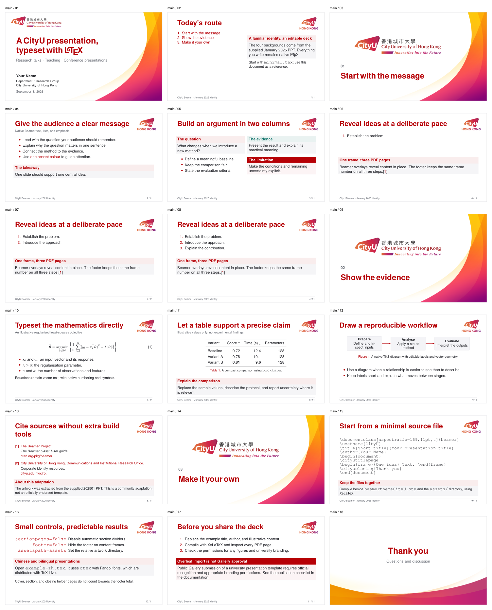

# CityU Beamer

[English](README.md) · [简体中文](README.zh.md)

Theme v1.0.1 · January 2025 PPT artwork · XeLaTeX · 16:9 · English and Chinese

> A reusable Beamer theme based on the January 2025 City University of Hong Kong PowerPoint template. This is a community adaptation, not an officially endorsed university template.

## Preview

The English example, including the title page, section dividers, content layouts, and closing slide. Click the overview to view it at full size.

[](previews/overview-en.png)

Full examples: [English PDF](previews/cityu-beamer-en.pdf) · [中文 PDF](previews/cityu-beamer-zh.pdf) · [Minimal PDF](previews/cityu-beamer-minimal.pdf).

The [preview index](previews/README.md) also includes the minimal example's overview. Previews are kept in the repository; they are not needed for compilation or included in the Overleaf ZIP.

## Features

- Four original backgrounds: title, section divider, content, and closing.
- Editable LaTeX text, equations, tables, references, and TikZ diagrams.
- English, Chinese, and minimal examples; portable TeX Live fonts.
- Optional section dividers and footer; overlay-aware frame numbering.
- Relative asset paths; no shell escape or external conversion tools required.

## Installation and compilation

For Overleaf, upload `cityu-beamer-overleaf.zip` as a new project and select **XeLaTeX**. Choose one main document:

- `main.tex`: the full English example.
- `example-zh.tex`: the full Chinese example.
- `minimal.tex`: a short starting point for your own presentation.

See the [usage guide](docs/USAGE.md) for import steps. If you have a repository checkout instead of the prepared ZIP, follow the [packaging instructions](docs/VALIDATION.md).

For local use, keep the theme and `assets/` beside your main `.tex` file. A TeX Live installation needs Beamer, fontspec, Latin Modern, TeX Gyre, TikZ, and booktabs; the Chinese example also needs ctex and Fandol.

```sh
latexmk -xelatex -outdir=build main.tex
latexmk -xelatex -outdir=build example-zh.tex
```

The supplied `latexmkrc` also selects XeLaTeX when you run `latexmk main.tex`.

Local builds have been checked with TeX Live 2026. Actual Overleaf cloud compilation has not been verified; the usage guide explains this limit and the separate Gallery eligibility requirements.

## Quick start

Copy `minimal.tex` and replace the metadata and frame content. For Chinese text, load `\usepackage[UTF8,fontset=fandol]{ctex}` before the theme, as in `example-zh.tex`.

```latex
\documentclass[aspectratio=169,11pt,t]{beamer}
\usetheme{CityU}
\title[Short title]{Your presentation title}
\author{Your Name}
\institute{Your department\\City University of Hong Kong}
\date{\today}

\begin{document}
\cityutitlepage
\section{Introduction}
\begin{frame}{One clear idea}
  Your content goes here.
\end{frame}
\cityuclosing[Questions and discussion]{Thank you}
\end{document}
```

Cover, divider, and closing helper pages are excluded from the frame counter. To disable automatic section dividers and the footer, replace the theme-loading line with:

```latex
\usetheme[sectionpages=false,footer=false]{CityU}
```

## Documentation

- Usage and customisation: [English](docs/USAGE.md) · [简体中文](docs/USAGE.zh.md)
- [Testing and maintenance](docs/VALIDATION.md) (English)
- [Version history](CHANGELOG.md)
- [Artwork provenance and rights](NOTICE.md)

## Contributing

Issues and pull requests are welcome in English or Chinese. User documentation is maintained in both languages; contributor and maintenance documentation is in English. See [CONTRIBUTING.md](CONTRIBUTING.md) for the supported scope and checks.

## License

Original theme code, examples, tools, configuration, and documentation use the [MIT License](LICENSE). CityU artwork, including artwork in the previews, is excluded. See [NOTICE.md](NOTICE.md) for provenance and rights; public redistribution permission for the branding has not been established by this project.

## Acknowledgments

Visual source: the January 2025 CityUHK PowerPoint template. Typesetting: the [Beamer Project](https://ctan.org/pkg/beamer), TeX Gyre, Latin Modern, and Fandol.
