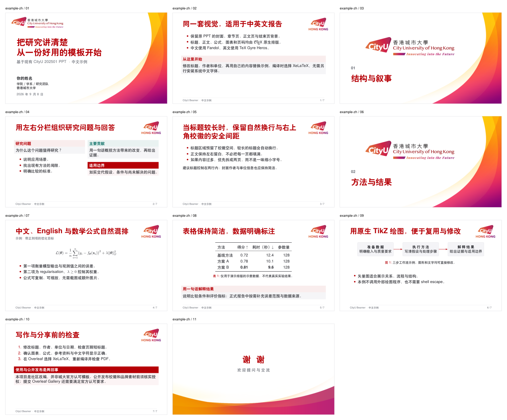

# CityU Beamer

[English](README.md) · [简体中文](README.zh.md)

主题 v1.0.1 · 2025 年 1 月 PPT 素材 · XeLaTeX · 16:9 · 中英文示例

> 基于香港城市大学 2025 年 1 月版 PowerPoint 模板制作的 Beamer 主题。这是社区改编版本，并非城大官方认可的模板。

## 预览

中文示例完整总览，包含封面、章节页、正文布局和结束页。点击图片可查看大图。

[](previews/overview-zh.png)

完整示例：[中文 PDF](previews/cityu-beamer-zh.pdf) · [英文 PDF](previews/cityu-beamer-en.pdf) · [最小示例 PDF](previews/cityu-beamer-minimal.pdf)。

[预览索引](previews/README.md)还提供最小示例总览。预览随仓库保留，不参与编译，也不放入 Overleaf ZIP。

## 功能

- 保留原 PPT 的四类背景：封面、章节页、正文页和结束页。
- 标题、正文、公式、表格、参考资料和 TikZ 图均可编辑。
- 提供英文演示、中文演示和最小示例；不依赖 Windows 字体。
- 自动章节页与页脚可以关闭；逐步显示不会重复增加帧页码。
- 使用相对路径，不需要 shell escape 或额外图片转换程序。

## 安装与编译

Overleaf：从 [Releases](https://github.com/inscripoem/cityu-beamer/releases) 下载 `cityu-beamer-overleaf.zip`，新建项目并上传，在项目设置中选择 **XeLaTeX**。主文档可选：

- `main.tex`：英文完整演示。
- `example-zh.tex`：中文完整演示。
- `minimal.tex`：从零写报告的简洁起点。

导入步骤见[使用指南](docs/USAGE.zh.md)。如果下载的是仓库源文件而不是专用 ZIP，可按[打包说明](docs/VALIDATION.md)生成导入包。

本地使用时，将 `.sty` 与 `assets/` 放在主 `.tex` 文件旁，在该目录运行：

```sh
latexmk -xelatex -outdir=build main.tex
latexmk -xelatex -outdir=build example-zh.tex
```

所需组件均来自 TeX Live：Beamer、fontspec、Latin Modern、TeX Gyre、TikZ、booktabs；中文示例另用 ctex 和 Fandol。附带的 `latexmkrc` 已将默认编译器设为 XeLaTeX。

已用 TeX Live 2026 检查本地编译；尚未验证真实 Overleaf 云端编译。使用指南说明了此项验证边界，以及独立的模板市场上架资格要求。

## 快速开始

建议复制 `minimal.tex` 并替换文档信息与正文。中文文档采用 `example-zh.tex` 的写法：先向 fontspec 传递 `no-math`，再依次加载 ctex 和主题，避免旧版 TeX Live 中的选项冲突：

```latex
\documentclass[aspectratio=169,11pt,t]{beamer}
\PassOptionsToPackage{no-math}{fontspec}
\usepackage[UTF8,fontset=fandol]{ctex}
\usetheme{CityU}
\title[页脚短标题]{你的报告标题}
\author{你的姓名}
\institute{学院／学系\\香港城市大学}
\date{\today}

\begin{document}
\cityutitlepage
\section{研究背景}
\begin{frame}{这一页的核心观点}
  在这里写正文。
\end{frame}
\cityuclosing[欢迎提问与交流]{谢谢}
\end{document}
```

默认封面、章节页与结束页不计入正文页码。关闭自动章节页或页脚时，将主题加载语句改为：

```latex
\usetheme[sectionpages=false,footer=false]{CityU}
```

## 文档

- 详细用法与自定义接口：[简体中文](docs/USAGE.zh.md) · [English](docs/USAGE.md)
- [测试与维护说明](docs/VALIDATION.md)（英文）
- [版本记录](CHANGELOG.md)（英文）
- [素材来源与权利声明](NOTICE.md)（英文）

## 参与修改

欢迎用中文或英文提交 Issue、PR。用户文档提供完整中英文版本，贡献与维护文档统一使用英文；支持范围和检查要求见[贡献说明](CONTRIBUTING.md)。

## 许可

原创主题代码、示例、工具、配置与文档采用 [MIT 许可](LICENSE)。CityU 品牌素材及预览中使用的这些素材不在其中，来源与权利边界见 [NOTICE.md](NOTICE.md)。本项目尚未确立公开再分发品牌素材的权限。

## 致谢

视觉来源为 2025 年 1 月版 CityUHK PowerPoint 模板。排版使用 [Beamer](https://ctan.org/pkg/beamer)、TeX Gyre、Latin Modern 和 Fandol。
